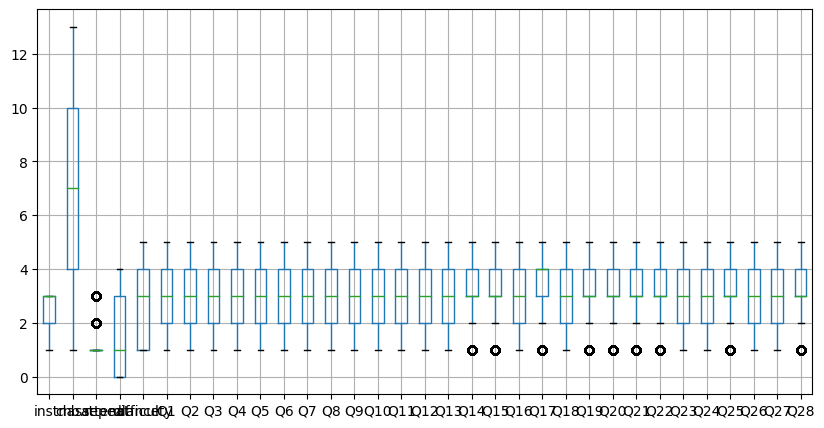
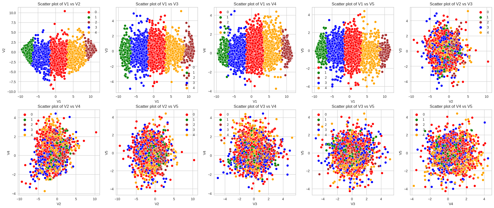
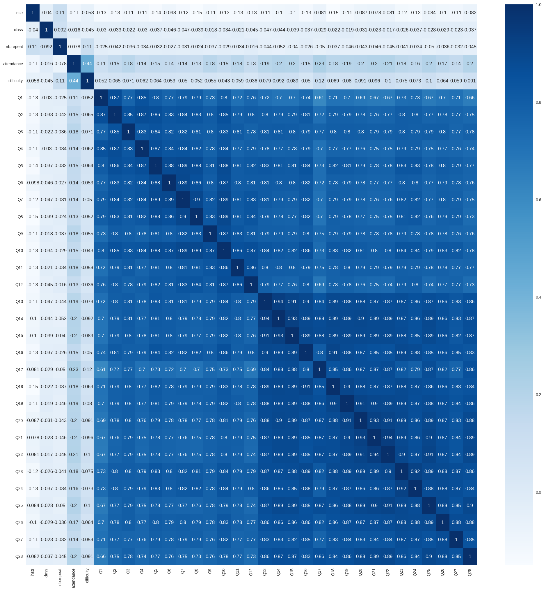

<div style="position: absolute; top: 0; right: 0;">
    <a href="ertugrulbusiness@gmail.com"></a>
    <a href="https://tr.linkedin.com/in/ertu%C4%9Fruldemir?original_referer=https%3A%2F%2Fwww.google.com%2F"></a>
    <a href="https://github.com/ertugruldmr"></a>
    <a href="https://www.kaggle.com/erturuldemir"></a>
    <a href="https://huggingface.co/ErtugrulDemir"></a>
    <a href="https://stackoverflow.com/users/21569249/ertu%c4%9frul-demir?tab=profile"></a>
    <a href="https://medium.com/@ertugrulbusiness"></a>
    <a href="https://www.youtube.com/channel/UCB0_UTu-zbIsoRBHgpsrlsA"></a>
</div>

# Student Clustering
 
## __Table Of Content__
- (A) [__Brief__](#brief)
  - [__Project__](#project)
  - [__Data__](#data)
  - [__Demo__](#demo) -> [Live Demo](https://ertugruldemir-studentclustering.hf.space)
  - [__Study__](#problemgoal-and-solving-approach) -> [Colab](https://colab.research.google.com/drive/11WF_vS51CKCTLLAoIfP6zU3wUOxD5lsU)
  - [__Results__](#results)
- (B) [__Detailed__](#Details)
  - [__Abstract__](#abstract)
  - [__Explanation of the study__](#explanation-of-the-study)
    - [__(A) Dependencies__](#a-dependencies)
    - [__(B) Dataset__](#b-dataset)
    - [__(C) Pre-processing__](#c-pre-processing)
    - [__(D) Exploratory Data Analysis__](#d-exploratory-data-analysis)
    - [__(E) Modelling__](#e-modelling)
    - [__(F) Saving the project__](#f-saving-the-project)
    - [__(G) Deployment as web demo app__](#g-deployment-as-web-demo-app)
  - [__Licance__](#license)
  - [__Connection Links__](#connection-links)

## __Brief__ 

### __Project__ 
- This is a __clustering__ project that uses the  [__Turkiye Student Evaluation Data Set__](http://archive.ics.uci.edu/ml/datasets/turkiye+student+evaluation) to __cluster the students__.
- The __goal__ is build a model that accurately __cluster the students__  based on the features. 
- The performance of the model is evaluated using several  __metrics__, including Distortion Score Elbow, dendogram, silhouette_score, distance metrics etc....

#### __Overview__
- This project involves building a machine learning model to clustering the students based on their features. The dataset contains 5820 records.32 attributes is selected as 28 features, all the features are already encoded categorical variable. The project uses Python and several popular libraries such as Pandas, NumPy, and Scikit-learn.
#### __Demo__

<div align="left">
  <table>
    <tr>
    <td>
        <a target="_blank" href="https://ertugruldemir-studentclustering.hf.space" height="30">[Demo app] HF Space</a>
      </td>
      <td>
        <a target="_blank" href="https://colab.research.google.com/drive/1HY264I6ek-cP67N05WyDbGVmHU4WNio6
">[Demo app] Run in Colab</a>
      </td>
      <td>
        <a target="_blank" href="https://github.com/ertugruldmr/StudentClustering/blob/main/study.ipynb">[Traning pipeline] source on GitHub</a>
      </td>
    <td>
        <a target="_blank" href="https://colab.research.google.com/drive/11WF_vS51CKCTLLAoIfP6zU3wUOxD5lsU">[Traning pipeline] Run in Colab</a>
      </td>
    </tr>
  </table>
</div>


- Description
    - __predict The House Price__  based on features.
    - __Usage__: Set the feature values through sliding the radio buttons then use the button to predict.
- Embedded [Demo](https://ertugruldemir-studentclustering.hf.space) window from HuggingFace Space
    

<iframe
	src="https://ertugruldemir-studentclustering.hf.space"
	frameborder="0"
	width="850"
	height="450"
></iframe>

#### __Data__
- The [__Turkiye Student Evaluation Data Set__](http://archive.ics.uci.edu/ml/datasets/turkiye+student+evaluation) from UCI website.
- The dataset contains 28 features, all the features are categorical.
- The dataset contains the following features:


<table>
<tr><th>Data Info </th></tr>
<tr><td>


| Column    | Description                                                                                       | Values                       |
|-----------|---------------------------------------------------------------------------------------------------|------------------------------|
| instr     | Instructor's identifier; values taken from {1,2,3}                                                | 1, 2, 3                      |
| class     | Course code (descriptor); values taken from {1-13}                                                | 1-13                         |
| repeat    | Number of times the student is taking this course; values taken from {0,1,2,3,...}                | 0, 1, 2, 3, ...              |
| attendance| Code of the level of attendance; values from {0, 1, 2, 3, 4}                                       | 0, 1, 2, 3, 4               |
| difficulty| Level of difficulty of the course as perceived by the student; values taken from {1,2,3,4,5}       | 1, 2, 3, 4, 5               |
| Q1-Q28    | Likert-type scale responses to the following questions:                                            | 1, 2, 3, 4, 5               |
| Q1        | The semester course content, teaching method and evaluation system were provided at the start.    |                              |
| Q2        | The course aims and objectives were clearly stated at the beginning of the period.                |                              |
| Q3        | The course was worth the amount of credit assigned to it.                                          |                              |
| Q4        | The course was taught according to the syllabus announced on the first day of class.              |                              |
| Q5        | The class discussions, homework assignments, applications and studies were satisfactory.          |                              |
| Q6        | The textbook and other courses resources were sufficient and up to date.                          |                              |
| Q7        | The course allowed field work, applications, laboratory, discussion and other studies.            |                              |
| Q8        | The quizzes, assignments, projects and exams contributed to helping the learning.                 |                              |
| Q9        | I greatly enjoyed the class and was eager to actively participate during the lectures.             |                              |
| Q10       | My initial expectations about the course were met at the end of the period or year.               |                              |
| Q11       | The course was relevant and beneficial to my professional development.                             |                              |
| Q12       | The course helped me look at life and the world with a new perspective.                             |                              |
| Q13       | The Instructor's knowledge was relevant and up to date.                                            |                              |
| Q14       | The Instructor came prepared for classes.                                                          |                              |
| Q15       | The Instructor taught in accordance with the announced lesson plan.                                |                              |
| Q16       | The Instructor was committed to the course and was understandable.                                 |                              |
| Q17       | The Instructor arrived on time for classes.                                                        |                              |
| Q18       | The Instructor has a smooth and easy to follow delivery/speech.                                    |                              |
| Q19       | The Instructor made effective use of class hours.                                                  |                              |
| Q20       | The Instructor explained the course and was eager to be helpful to students.                        |                              |
| Q21       | The Instructor demonstrated a positive approach to students.                                       |                              |
| Q22       | The Instructor was open and respectful of the views of students about the course.                   |                              |
| Q23       | The Instructor encouraged participation in the course.                                             |                              |
| Q24       | The Instructor gave relevant homework assignments/projects, and helped/guided students.          | {1, 2, 3, 4, 5}              |
| Q25       | The Instructor responded to questions about the course inside and outside of the course.         | {1, 2, 3, 4, 5}              |
| Q26       | The Instructor's evaluation system (midterm and final questions, projects, assignments, etc.) effectively measured the course objectives. | {1, 2, 3, 4, 5} |
| Q27       | The Instructor provided solutions to exams and discussed them with students.                     | {1, 2, 3, 4, 5}              |
| Q28       | The Instructor treated all students in a right and objective manner.                              | {1, 2, 3, 4, 5}              |


</td></tr> </table>

<table>
<tr><th>Data Info </th><th><div style="padding-left: 50px;">Stats</div></th></tr>
<tr><td>


|    | Column      | Non-Null Count | Dtype  |
|---:|:------------|---------------|--------|
|  0 | instr       | 5820 non-null | int64  |
|  1 | class       | 5820 non-null | int64  |
|  2 | nb.repeat   | 5820 non-null | int64  |
|  3 | attendance  | 5820 non-null | int64  |
|  4 | difficulty  | 5820 non-null | int64  |
|  5 | Q1          | 5820 non-null | int64  |
|  6 | Q2          | 5820 non-null | int64  |
|  7 | Q3          | 5820 non-null | int64  |
|  8 | Q4          | 5820 non-null | int64  |
|  9 | Q5          | 5820 non-null | int64  |
| 10 | Q6          | 5820 non-null | int64  |
| 11 | Q7          | 5820 non-null | int64  |
| 12 | Q8          | 5820 non-null | int64  |
| 13 | Q9          | 5820 non-null | int64  |
| 14 | Q10         | 5820 non-null | int64  |
| 15 | Q11         | 5820 non-null | int64  |
| 16 | Q12         | 5820 non-null | int64  |
| 17 | Q13         | 5820 non-null | int64  |
| 18 | Q14         | 5820 non-null | int64  |
| 19 | Q15         | 5820 non-null | int64  |
| 20 | Q16         | 5820 non-null | int64  |
| 21 | Q17         | 5820 non-null | int64  |
| 22 | Q18         | 5820 non-null | int64  |
| 23 | Q19         | 5820 non-null | int64  |
| 24 | Q20         | 5820 non-null | int64  |
| 25 | Q21         | 5820 non-null | int64  |
| 26 | Q22         | 5820 non-null | int64  |
| 27 | Q23         | 5820 non-null | int64  |
| 28 | Q24         | 5820 non-null | int64  |
| 29 | Q25         | 5820 non-null | int64  |
| 30 | Q26         | 5820 non-null | int64  |
| 31 | Q27         | 5820 non-null | int64  |
| 32 | Q28         | 5820 non-null | int64  |


</td><td>


<div style="flex: 50%; padding-left: 50px;">

|   | count  | mean     | std      | min | 25% | 50% | 75% | max |
|---|--------|----------|----------|-----|-----|-----|-----|-----|
| instr      | 5820.0 | 2.485567 | 0.718473 | 1.0 | 2.0 | 3.0 | 3.0 | 3.0 |
| class      | 5820.0 | 7.276289 | 3.688175 | 1.0 | 4.0 | 7.0 | 10.0 | 13.0 |
| nb.repeat  | 5820.0 | 1.214089 | 0.532376 | 1.0 | 1.0 | 1.0 | 1.0 | 3.0 |
| attendance | 5820.0 | 1.675601 | 1.474975 | 0.0 | 0.0 | 1.0 | 3.0 | 4.0 |
| difficulty | 5820.0 | 2.783505 | 1.348987 | 1.0 | 1.0 | 3.0 | 4.0 | 5.0 |
| Q1         | 5820.0 | 2.929897 | 1.341077 | 1.0 | 2.0 | 3.0 | 4.0 | 5.0 |
| Q2         | 5820.0 | 3.073883 | 1.285251 | 1.0 | 2.0 | 3.0 | 4.0 | 5.0 |
| Q3         | 5820.0 | 3.178694 | 1.253567 | 1.0 | 2.0 | 3.0 | 4.0 | 5.0 |
| Q4         | 5820.0 | 3.082474 | 1.284594 | 1.0 | 2.0 | 3.0 | 4.0 | 5.0 |
| Q5         | 5820.0 | 3.105842 | 1.278989 | 1.0 | 2.0 | 3.0 | 4.0 | 5.0 |
| Q6         | 5820.0 | 3.107388 | 1.280807 | 1.0 | 2.0 | 3.0 | 4.0 | 5.0 |
| Q7         | 5820.0 | 3.066323 | 1.279097 | 1.0 | 2.0 | 3.0 | 4.0 | 5.0 |
| Q8         | 5820.0 | 3.041924 | 1.283481 | 1.0 | 2.0 | 3.0 | 4.0 | 5.0 |
| Q9         | 5820.0 | 3.165979 | 1.268930 | 1.0 | 2.0 | 3.0 | 4.0 | 5.0 |
| Q10        | 5820.0 | 3.090722 | 1.275309 | 1.0 | 2.0 | 3.0 | 4.0 |
|Q11| 5820.0 | 3.183849 | 1.295443 | 1.0 | 2.0 | 3.0 | 4.0 | 5.0 |
|Q12| 5820.0 | 3.035567 | 1.305772 | 1.0 | 2.0 | 3.0 | 4.0 | 5.0 |
|Q13| 5820.0 | 3.242784 | 1.264201 | 1.0 | 2.0 | 3.0 | 4.0 | 5.0 |
|Q14| 5820.0 | 3.290893 | 1.255373 | 1.0 | 3.0 | 3.0 | 4.0 | 5.0 |
|Q15| 5820.0 | 3.287285 | 1.253122 | 1.0 | 3.0 | 3.0 | 4.0 | 5.0 |
|Q16| 5820.0 | 3.169588 | 1.288015 | 1.0 | 2.0 | 3.0 | 4.0 | 5.0 |
|Q17| 5820.0 | 3.398454 | 1.267530 | 1.0 | 3.0 | 4.0 | 4.0 | 5.0 |
|Q18| 5820.0 | 3.222509 | 1.279799 | 1.0 | 2.0 | 3.0 | 4.0 | 5.0 |
|Q19| 5820.0 | 3.261684 | 1.268442 | 1.0 | 3.0 | 3.0 | 4.0 | 5.0 |
|Q20| 5820.0 | 3.285395 | 1.276848 | 1.0 | 3.0 | 3.0 | 4.0 | 5.0 |
| Q21 | 5820.0 | 3.307388 | 1.269974 | 1.0 | 3.0 | 3.0 | 4.0 | 5.0 |
| Q22 | 5820.0 | 3.317526 | 1.268358 | 1.0 | 3.0 | 3.0 | 4.0 | 5.0 |
| Q23 | 5820.0 | 3.201890 | 1.272590 | 1.0 | 2.0 | 3.0 | 4.0 | 5.0 |
| Q24 | 5820.0 | 3.166838 | 1.275909 | 1.0 | 2.0 | 3.0 | 4.0 | 5.0 |
| Q25 | 5820.0 | 3.312543 | 1.257286 | 1.0 | 3.0 | 3.0 | 4.0 | 5.0 |
| Q26 | 5820.0 | 3.222165 | 1.270695 | 1.0 | 2.0 | 3.0 | 4.0 | 5.0 |
| Q27 | 5820.0 | 3.154811 | 1.291872 | 1.0 | 2.0 | 3.0 | 4.0 | 5.0 |
| Q28 | 5820.0 | 3.308076 | 1.278709 | 1.0 | 3.0 | 3.0 | 4.0 | 5.0 |


</div>

</td></tr> </table>


#### Problem, Goal and Solving approach
- This is a __clustering__ problem  that uses  [__Turkiye Student Evaluation Data Set__](http://archive.ics.uci.edu/ml/datasets/turkiye+student+evaluation)  from UCI to __cluster the students__ based on 28 features which all of them are categorical typed.
- The __goal__ is to build a model that accurately __clustering the students__ based on the features.
- __Solving approach__ is that using the unsupervised machine learning models (knn, Hierarchical Clusterings (dendogram, Agg...)).

#### Study
The project aimed predict the wine quality score classes using the features. The study includes following chapters.
- __(A) Dependencies__: Installations and imports of the libraries.
- __(B) Dataset__: Downloading and loading the dataset.
- __(C) Pre-processing__: It includes data type casting, missing value handling, outlier handling.
- __(D) Exploratory Data Analysis__: Univariate, Bivariate, Multivariate anaylsises. Correlation and other relations. 
- __(E) Modelling__: Model tuning via GridSearch and KElbowVisualizer on knn, dendogram, AgglomerativeClustering.  
- __(F) Saving the project__: Saving the project and demo studies.
- __(G) Deployment as web demo app__: Creating Gradio Web app to Demostrate the project.Then Serving the demo via huggingface as live.

#### results
- The final model is __knn cluster__ because of the results and less complexity.
- Following figures are clustered label distribution and KelBowTuning
  <div style="text-align: center;">
      
      
      
  </div>


## Details

### Abstract
- [__Turkiye Student Evaluation Data Set__](http://archive.ics.uci.edu/ml/datasets/turkiye+student+evaluation) is used to cluster the students. The dataset contains 5820 records.32 attributes is selected as 28 features, all the features are already encoded categorical variable. The problem is an unsupervised learning task as clustering problem. The goal is clustering the students through using unsupervised machine learning algorithms such as knn, pca with knn, dendogramand, AgglomerativeClustering amd other similar models.The study includes creating the environment, getting the data, preprocessing the data, exploring the data, modelling the data, saving the results, deployment as demo app. Training phase of the models implemented through cross validation and Grid Search model tuning and KElbow approachs.  Models are evaluated with cross validation methods using 5 split. clustering results collected and compared between the models. Selected the basic and more succesful model. Tuned __knn cluster__ model has been selected as final model after the whole study.  Related results can be found at the results section. pca implemented for 2d and 3d visualization. Created a demo at the demo app section and served on huggingface space.  

### File Structures

- File Structure Tree
```bash
├── demo_app
│   ├── app.py
│   ├── component_configs.json
│   ├── examples.pkl
│   ├── requirements.txt
│   └── knn_mdoel.sav
├── docs
│   └── images
├── env
│   ├── env_installation.md
│   └── requirements.txt
├── LICENSE
├── readme.md
└── study.ipynb
```
- Description of the files
  - demo_app/
    - Includes the demo web app files, it has the all the requirements in the folder so it can serve on anywhere.
  - demo_app/component_configs.json :
    - It includes the web components to generate web page.
  - demo_app/cat_encods.json
    - It includes the encoding and decoding maps for preparing the data into model format.
  - demo_app/examples.pkl
    - It includes example cases to run the demo.
  - demo_app/rf_model.sav:
    - The trained (Model Tuned) model as pickle (python object saving) format.
  - demo_app/requirements.txt
    - It includes the dependencies of the demo_app.
  - docs/
    - Includes the documents about results and presentations
  - env/
    - It includes the training environmet related files. these are required when you run the study.ipynb file.
  - LICENSE.txt
    - It is the pure apache 2.0 licence. It isn't edited.
  - readme.md
    - It includes all the explanations about the project
  - study.ipynb
    - It is all the studies about solving the problem which reason of the dataset existance.    


### Explanation of the Study
#### __(A) Dependencies__:
  -  There is no third-parth installation. The libraries which already installed on the environment are enough. You can create an environment via env/requirements.txt. Create a virtual environment then use hte following code. It is enough to satisfy the requirements for runing the study.ipynb which training pipeline.
#### __(B) Dataset__: 
  - Downloading the [__Turkiye Student Evaluation Data Set__](http://archive.ics.uci.edu/ml/datasets/turkiye+student+evaluation) via UCI platform. The dataset has  5820 records.32 attributes is selected as 28 features, all the features are already encoded categorical variable. For more info such as histograms and etc... you can look the '(D) Exploratory Data Analysis' chapter.
#### __(C) Pre-processing__: 
  - The processes are below:
    - Preparing the dtypes such as casting the object type to categorical type.
    - Missing value processes: there was no missing value.
    - Outlier analysis processes: uses  both visual and IQR calculation apporachs. According to IQR approach ,there was no outlier as significant..

      <div style="text-align: center;">
          
      </div>
 
#### __(D) Exploratory Data Analysis__:
  - Dataset Stats
<table>
<tr><th>Data Info </th></tr>
<tr><td>


| Column    | Description                                                                                       | Values                       |
|-----------|---------------------------------------------------------------------------------------------------|------------------------------|
| instr     | Instructor's identifier; values taken from {1,2,3}                                                | 1, 2, 3                      |
| class     | Course code (descriptor); values taken from {1-13}                                                | 1-13                         |
| repeat    | Number of times the student is taking this course; values taken from {0,1,2,3,...}                | 0, 1, 2, 3, ...              |
| attendance| Code of the level of attendance; values from {0, 1, 2, 3, 4}                                       | 0, 1, 2, 3, 4               |
| difficulty| Level of difficulty of the course as perceived by the student; values taken from {1,2,3,4,5}       | 1, 2, 3, 4, 5               |
| Q1-Q28    | Likert-type scale responses to the following questions:                                            | 1, 2, 3, 4, 5               |
| Q1        | The semester course content, teaching method and evaluation system were provided at the start.    |                              |
| Q2        | The course aims and objectives were clearly stated at the beginning of the period.                |                              |
| Q3        | The course was worth the amount of credit assigned to it.                                          |                              |
| Q4        | The course was taught according to the syllabus announced on the first day of class.              |                              |
| Q5        | The class discussions, homework assignments, applications and studies were satisfactory.          |                              |
| Q6        | The textbook and other courses resources were sufficient and up to date.                          |                              |
| Q7        | The course allowed field work, applications, laboratory, discussion and other studies.            |                              |
| Q8        | The quizzes, assignments, projects and exams contributed to helping the learning.                 |                              |
| Q9        | I greatly enjoyed the class and was eager to actively participate during the lectures.             |                              |
| Q10       | My initial expectations about the course were met at the end of the period or year.               |                              |
| Q11       | The course was relevant and beneficial to my professional development.                             |                              |
| Q12       | The course helped me look at life and the world with a new perspective.                             |                              |
| Q13       | The Instructor's knowledge was relevant and up to date.                                            |                              |
| Q14       | The Instructor came prepared for classes.                                                          |                              |
| Q15       | The Instructor taught in accordance with the announced lesson plan.                                |                              |
| Q16       | The Instructor was committed to the course and was understandable.                                 |                              |
| Q17       | The Instructor arrived on time for classes.                                                        |                              |
| Q18       | The Instructor has a smooth and easy to follow delivery/speech.                                    |                              |
| Q19       | The Instructor made effective use of class hours.                                                  |                              |
| Q20       | The Instructor explained the course and was eager to be helpful to students.                        |                              |
| Q21       | The Instructor demonstrated a positive approach to students.                                       |                              |
| Q22       | The Instructor was open and respectful of the views of students about the course.                   |                              |
| Q23       | The Instructor encouraged participation in the course.                                             |                              |
| Q24       | The Instructor gave relevant homework assignments/projects, and helped/guided students.          | {1, 2, 3, 4, 5}              |
| Q25       | The Instructor responded to questions about the course inside and outside of the course.         | {1, 2, 3, 4, 5}              |
| Q26       | The Instructor's evaluation system (midterm and final questions, projects, assignments, etc.) effectively measured the course objectives. | {1, 2, 3, 4, 5} |
| Q27       | The Instructor provided solutions to exams and discussed them with students.                     | {1, 2, 3, 4, 5}              |
| Q28       | The Instructor treated all students in a right and objective manner.                              | {1, 2, 3, 4, 5}              |


</td></tr> </table>

<table>
<tr><th>Data Info </th><th><div style="padding-left: 50px;">Stats</div></th></tr>
<tr><td>


|    | Column      | Non-Null Count | Dtype  |
|---:|:------------|---------------|--------|
|  0 | instr       | 5820 non-null | int64  |
|  1 | class       | 5820 non-null | int64  |
|  2 | nb.repeat   | 5820 non-null | int64  |
|  3 | attendance  | 5820 non-null | int64  |
|  4 | difficulty  | 5820 non-null | int64  |
|  5 | Q1          | 5820 non-null | int64  |
|  6 | Q2          | 5820 non-null | int64  |
|  7 | Q3          | 5820 non-null | int64  |
|  8 | Q4          | 5820 non-null | int64  |
|  9 | Q5          | 5820 non-null | int64  |
| 10 | Q6          | 5820 non-null | int64  |
| 11 | Q7          | 5820 non-null | int64  |
| 12 | Q8          | 5820 non-null | int64  |
| 13 | Q9          | 5820 non-null | int64  |
| 14 | Q10         | 5820 non-null | int64  |
| 15 | Q11         | 5820 non-null | int64  |
| 16 | Q12         | 5820 non-null | int64  |
| 17 | Q13         | 5820 non-null | int64  |
| 18 | Q14         | 5820 non-null | int64  |
| 19 | Q15         | 5820 non-null | int64  |
| 20 | Q16         | 5820 non-null | int64  |
| 21 | Q17         | 5820 non-null | int64  |
| 22 | Q18         | 5820 non-null | int64  |
| 23 | Q19         | 5820 non-null | int64  |
| 24 | Q20         | 5820 non-null | int64  |
| 25 | Q21         | 5820 non-null | int64  |
| 26 | Q22         | 5820 non-null | int64  |
| 27 | Q23         | 5820 non-null | int64  |
| 28 | Q24         | 5820 non-null | int64  |
| 29 | Q25         | 5820 non-null | int64  |
| 30 | Q26         | 5820 non-null | int64  |
| 31 | Q27         | 5820 non-null | int64  |
| 32 | Q28         | 5820 non-null | int64  |


</td><td>


<div style="flex: 50%; padding-left: 50px;">

|   | count  | mean     | std      | min | 25% | 50% | 75% | max |
|---|--------|----------|----------|-----|-----|-----|-----|-----|
| instr      | 5820.0 | 2.485567 | 0.718473 | 1.0 | 2.0 | 3.0 | 3.0 | 3.0 |
| class      | 5820.0 | 7.276289 | 3.688175 | 1.0 | 4.0 | 7.0 | 10.0 | 13.0 |
| nb.repeat  | 5820.0 | 1.214089 | 0.532376 | 1.0 | 1.0 | 1.0 | 1.0 | 3.0 |
| attendance | 5820.0 | 1.675601 | 1.474975 | 0.0 | 0.0 | 1.0 | 3.0 | 4.0 |
| difficulty | 5820.0 | 2.783505 | 1.348987 | 1.0 | 1.0 | 3.0 | 4.0 | 5.0 |
| Q1         | 5820.0 | 2.929897 | 1.341077 | 1.0 | 2.0 | 3.0 | 4.0 | 5.0 |
| Q2         | 5820.0 | 3.073883 | 1.285251 | 1.0 | 2.0 | 3.0 | 4.0 | 5.0 |
| Q3         | 5820.0 | 3.178694 | 1.253567 | 1.0 | 2.0 | 3.0 | 4.0 | 5.0 |
| Q4         | 5820.0 | 3.082474 | 1.284594 | 1.0 | 2.0 | 3.0 | 4.0 | 5.0 |
| Q5         | 5820.0 | 3.105842 | 1.278989 | 1.0 | 2.0 | 3.0 | 4.0 | 5.0 |
| Q6         | 5820.0 | 3.107388 | 1.280807 | 1.0 | 2.0 | 3.0 | 4.0 | 5.0 |
| Q7         | 5820.0 | 3.066323 | 1.279097 | 1.0 | 2.0 | 3.0 | 4.0 | 5.0 |
| Q8         | 5820.0 | 3.041924 | 1.283481 | 1.0 | 2.0 | 3.0 | 4.0 | 5.0 |
| Q9         | 5820.0 | 3.165979 | 1.268930 | 1.0 | 2.0 | 3.0 | 4.0 | 5.0 |
| Q10        | 5820.0 | 3.090722 | 1.275309 | 1.0 | 2.0 | 3.0 | 4.0 |
|Q11| 5820.0 | 3.183849 | 1.295443 | 1.0 | 2.0 | 3.0 | 4.0 | 5.0 |
|Q12| 5820.0 | 3.035567 | 1.305772 | 1.0 | 2.0 | 3.0 | 4.0 | 5.0 |
|Q13| 5820.0 | 3.242784 | 1.264201 | 1.0 | 2.0 | 3.0 | 4.0 | 5.0 |
|Q14| 5820.0 | 3.290893 | 1.255373 | 1.0 | 3.0 | 3.0 | 4.0 | 5.0 |
|Q15| 5820.0 | 3.287285 | 1.253122 | 1.0 | 3.0 | 3.0 | 4.0 | 5.0 |
|Q16| 5820.0 | 3.169588 | 1.288015 | 1.0 | 2.0 | 3.0 | 4.0 | 5.0 |
|Q17| 5820.0 | 3.398454 | 1.267530 | 1.0 | 3.0 | 4.0 | 4.0 | 5.0 |
|Q18| 5820.0 | 3.222509 | 1.279799 | 1.0 | 2.0 | 3.0 | 4.0 | 5.0 |
|Q19| 5820.0 | 3.261684 | 1.268442 | 1.0 | 3.0 | 3.0 | 4.0 | 5.0 |
|Q20| 5820.0 | 3.285395 | 1.276848 | 1.0 | 3.0 | 3.0 | 4.0 | 5.0 |
| Q21 | 5820.0 | 3.307388 | 1.269974 | 1.0 | 3.0 | 3.0 | 4.0 | 5.0 |
| Q22 | 5820.0 | 3.317526 | 1.268358 | 1.0 | 3.0 | 3.0 | 4.0 | 5.0 |
| Q23 | 5820.0 | 3.201890 | 1.272590 | 1.0 | 2.0 | 3.0 | 4.0 | 5.0 |
| Q24 | 5820.0 | 3.166838 | 1.275909 | 1.0 | 2.0 | 3.0 | 4.0 | 5.0 |
| Q25 | 5820.0 | 3.312543 | 1.257286 | 1.0 | 3.0 | 3.0 | 4.0 | 5.0 |
| Q26 | 5820.0 | 3.222165 | 1.270695 | 1.0 | 2.0 | 3.0 | 4.0 | 5.0 |
| Q27 | 5820.0 | 3.154811 | 1.291872 | 1.0 | 2.0 | 3.0 | 4.0 | 5.0 |
| Q28 | 5820.0 | 3.308076 | 1.278709 | 1.0 | 3.0 | 3.0 | 4.0 | 5.0 |


</div>

</td></tr> </table>
  - Variable Analysis
    - Univariate analysis, 
      <div style="text-align: center;">
          
           
      </div>
    - Bivariate analysis
      <div style="text-align: center;">
          
          
          
          
      </div>
    - Multivariate analysis.
      <div style="text-align: center;">
          
      </div>
  - Other relations.
    <div style="display:flex; justify-content: center; align-items:center;">
      <div style="text-align: center;">
      <figure>
      <p>Correlation</p>
      
      </figure>
      </div>
      <div style="text-align: center;">
      <figure>
      <p>Variance</p>
      
      </figure>
      </div>
    </div>

#### __(E) Modelling__: 
  - Data Split
    - Splitting the dataset via  sklearn.model_selection.train_test_split (test_size = 0.2).
  - Util Functions
    - Greedy Step Tune
      - It is a custom tuning approach created by me. It tunes just a hyperparameter per step using through GridSerchCV. It assumes the params ordered by importance so it reduces the computation and time consumption.  
    - KelBOw
      - It tunes knn then returns the Distortion results over neighbour size.

  - knn with kelbow
      <div style="display:flex; justify-content: center; align-items:center;">
          
          
      </div>
  - AgglomerativeClustering with silhouette_scorer
      <div style="display:flex; justify-content: center; align-items:center;">
          
      </div>
  - AgglomerativeClustering with dendogram
      <div style="display:flex; justify-content: center; align-items:center;">
          
          
          
      </div>

#### __(F) Saving the project__: 
  - Saving the project and demo studies.
    - trained model __knn_model.sav__ as pickle format.
#### __(G) Deployment as web demo app__: 
  - Creating Gradio Web app to Demostrate the project.Then Serving the demo via huggingface as live.
  - Desciption
    - Project goal is predicting the sales price based on four features.
    - Usage: Set the feature values through radio buttons then use the button to predict.
  - Demo
    - The demo app in the demo_app folder as an individual project. All the requirements and dependencies are in there. You can run it anywhere if you install the requirements.txt.
    - You can find the live demo as huggingface space in this [demo link](https://ertugruldemir-studentclustering.hf.space) as full web page or you can also us the [embedded demo widget](#demo)  in this document.  
    
## License
- This project is licensed under the Apache 2.0 License. See the [LICENSE](LICENSE) file for details.

<h1 style="text-align: center;">Connection Links</h1>

<div style="text-align: center;">
    <a href="ertugrulbusiness@gmail.com"></a>
    <a href="https://tr.linkedin.com/in/ertu%C4%9Fruldemir?original_referer=https%3A%2F%2Fwww.google.com%2F"></a>
    <a href="https://github.com/ertugruldmr"></a>
    <a href="https://www.kaggle.com/erturuldemir"></a>
    <a href="https://huggingface.co/ErtugrulDemir"></a>
    <a href="https://stackoverflow.com/users/21569249/ertu%c4%9frul-demir?tab=profile"></a>
    <a href="https://www.hackerrank.com/ertugrulbusiness"></a>
    <a href="https://app.patika.dev/ertugruldmr"></a>
    <a href="https://medium.com/@ertugrulbusiness"></a>
    <a href="https://www.youtube.com/channel/UCB0_UTu-zbIsoRBHgpsrlsA"></a>
</div>

